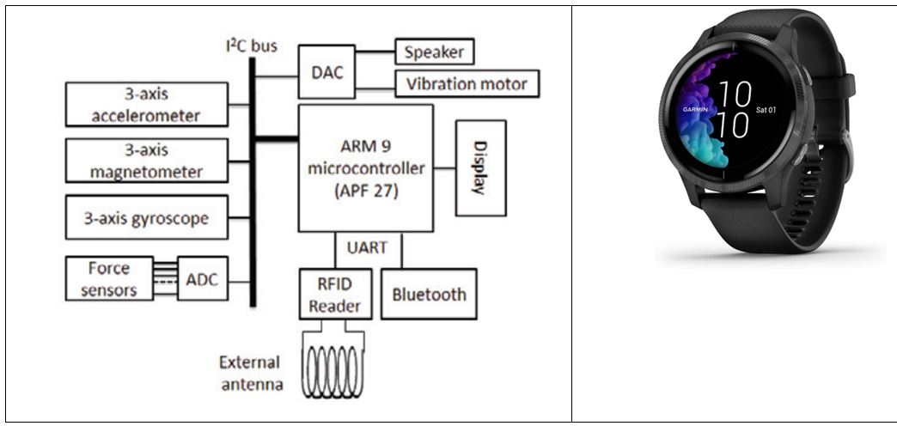

<body>
    

        <h1>Introduction to Pattern Recognition</h1>
        
        
Author: Hadi Sadoghi Yazdi

        
Dedicated to those who have devoted themselves to guiding humanity

        <h3 class="preface">Preface</h3>
        
The book "Pattern Recognition" covers four main topics: clustering, classification, feature reduction, and classifier fusion, emphasizing their cost functions. It integrates both theoretical and practical aspects, offering ready-to-use codes for students and researchers. The book's unique approach categorizes methods based on cost functions, providing a comprehensive review of techniques from past to present. It includes detailed explanations and practical coding support, making it a valuable resource for understanding and applying pattern recognition concepts.

        <h4 class="Lesson 1: Introduction and Overview">Lesson 1: Introduction and Overview</h4>
        
Nowadays, every individual is accompanied by a set of sensors that continuously collect various types of data. Additionally, people themselves contribute to the data pool by uploading photos, videos, and text. Smart watches and mobile phones, which many people carry, are equipped with an array of sensors including gyroscopes, accelerometers, three-axis magnetometers (x, y, z), and force sensors, which are common in most smart watches. The diagram below, along with an image of a smartwatch, illustrates the sensors and their structure within the watch.

        
    </body>